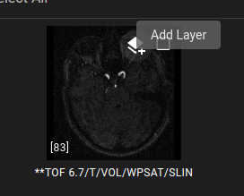

# Loading Data

The most straightfoward way to load files into mediview-3d is to drag-and-drop them onto the central window when viewing the "Data" tab. You can also click within the central window to open a file browser and select the files or folders the "Open" button on the top-right toolbar. To complement different use-cases, there are a few other ways to open files.

## File formats

mediview-3d can load multiple DICOM files, folders containing multiple DICOM files, or zipped files containing multiple DICOM files. It also supports loading Nifti, NRRD, MHA, and 20+ other file formats thanks to the extensive I/O capabilities of ITK and itk.wasm, but care must be taken when loading non-DICOM data as the orientation of the data in those files cannot be assured.

## Sample Data

mediview-3d includes links to a variety of sample data. Clicking on those thumbnails in the Data tab will download that data from Kitware data.kitware.com website into your local machine.

## DICOMWeb

mediview-3d lists and downloads DICOM files served by a DICOMWeb service. The host address of the DICOMWeb service is configurable by:

- mediview-3d settings menu
- `dicomweb` URL parameter. Example: `https://mediview-3d.kitware.app/?dicomweb=https://dicomweb-server.com`
- At mediview-3d build time with the `VITE_DICOM_WEB_URL` environment variable.

The DICOMWeb address can point to a specific series in a study, and mediview-3d will
automatically load the whole series. Example URL:

```
https://mediview-3d.kitware.app/?dicomweb=https://dicomweb-server.com/studies/unique-study-id-here/series/unique-series-id-here
```

## Loading Remote Data via URLs

mediview-3d supports loading remote datasets at application start through URL parameters. An example of this integration in action can be viewed here: [mediview-3d with sample data](https://mediview-3d.kitware.app/?names=[prostate-mri.zip,neck.mha]&urls=[https://data.kitware.com/api/v1/item/63527c7311dab8142820a338/download,https://data.kitware.com/api/v1/item/620db4b84acac99f42e75420/download])

The URL is constructed with two parts, as shown below. The required parameter is the `urls` parameter, which specifies a list of URLs to download. An optional `names` parameter specifies the filename to go along with the file. If mediview-3d cannot infer the file type, the filename's extension is used as a fallback. Loading multiple URLs is achieved by separating them with a comma.

```
https://mediview-3d.kitware.app/?names=[prostate-mri.zip,neck.mha]&urls=[https://data.kitware.com/api/v1/item/63527c7311dab8142820a338/download,https://data.kitware.com/api/v1/item/620db4b84acac99f42e75420/download]
```

### Google Cloud Storage Bucket and AWS S3 Support

mediview-3d supports both Google Cloud Storage links of the form
`gs://<bucket>/<object>` and Amazon AWS S3 buckets of the form
`s3://<bucket>/<object>`. mediview-3d can either download a single object, or
download everything underneath a given object prefix/folder. As an example,
mediview-3d will download and load every file that exists in the
`gs://my-public-bucket/my-patient-folder/` folder.

As a note of caution, there are no checks on the size of the total download. As
such, be careful when specifying bucket-level prefixes!

This feature currently only supports public buckets that are anonymously
accessible. Authenticated support may be added at a future date. If you have a
strong use-case for it, please request it via [our issue
page](https://github.com/Kitware/mediview-3d/issues)!

### CORS

In order for mediview-3d to download and display your remote datasets, your server must be configured with the correct [CORS](https://developer.mozilla.org/en-US/docs/Web/HTTP/CORS) configuration. CORS is a browser security mechanism that restricts how web applications can access remote resources. Without proper CORS configuration, mediview-3d will be unable to download and display your datasets. Configuring your web server with CORS is beyond the scope of this documentation; please refer to your server's documentation.

## Layer Images

To overlay images in the 2D views, there is a layer button on image thumbnails. A PET image could be layered on top of a CT image. The layered image is resampled to the base image using the image's spatial metadata. If the spatial metadata does not place the images in the same coordinate system, the layer alignment will be incorrect.

To layer images:

1. Load the base image.
1. On the Data tab, click the Add Layer button on the upper layer dataset.
1. Under the Rendering tab, an opacity slider changes the transparency of the upper layer.


